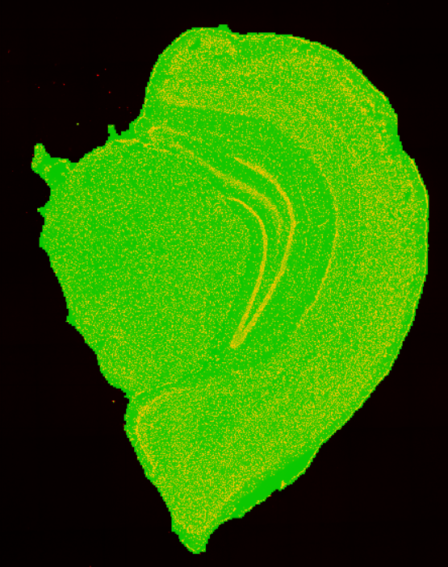
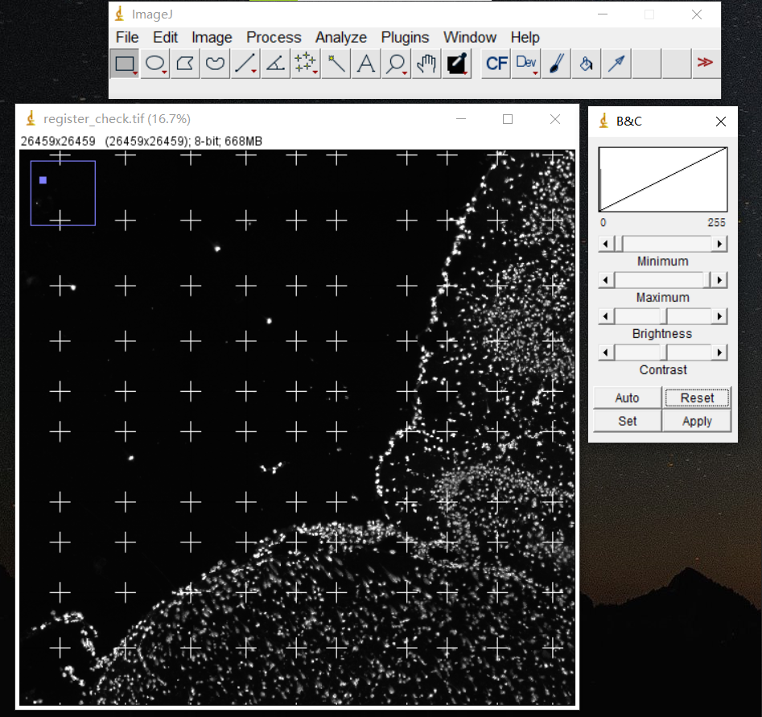

# Format conversion

This tutorial will show how to implement basic format conversions using the complementary pipeline `SAW convert`. To make this utility more straightforward and concise, several pipelines have been created under `SAW convert`. The sub-pipeline is usually named as "A2B", which signifies the switching from A-form to B-form.

Select the one you need for format conversion.

## Matrix related

### `visualization`

Conversion from a raw GEF to a visualization GEF.

The raw GEF only saves the gene expression in the bin1 dimension to prevent the output file from becoming too large. **For GEF to be visualized in StereoMap**, it is necessary to have comprehensive information on various bin sizes, usually with a bin list of \[ 1, 5, 10, 20, 50, 100, 150, 200].

```sh
saw convert visualization \
    --gef=/path/to/input/GEF \
    --bin-size=1,5,10,20,50,100,150,200 \
    --visualization-gef=/path/to/output/visualization/GEF
```

### `gef2gem`

Conversion from a bin GEF to a GEM.

The feature expression recorded in GEM has only one type of bin size, so you have to set `--bin-size` for the conversion.

```sh
saw convert gef2gem \
    --gef=/path/to/input/GEF \
    --bin-size=1 \
    --gem=/path/to/output/GEM
```

Conversion from a cellbin GEF to a cellbin GEM.


It is important to note that the corresponding bin GEF is necessary to obtain DNB information, during the conversion from cellbin GEF to cellbin GEM.


```sh
saw convert gef2gem \
    --cellbin-gef=/path/to/input/cellbin/GEF \
    --gef=/path/to/input/bin/GEF \
    --cellbin-gem=/path/to/output/cellbin/GEM
```

### `gem2gef`

Conversion from a GEM to a bin GEF.

* If your input GEM is of bin1, the output GEF will be a visualization GEF that includes expression counts of bin1, 5, 10, 20, 50, 100, 150, 200.
* If your input GEM is not of bin1, the output GEF will contain the expression counts of that specific bin size.

```sh
saw convert gem2gef \
    --gem=/path/to/input/GEM \
    --gef=/path/to/output/GEF
```

Conversion from a cellbin GEM to a cellbin GEF.

```bash
saw convert gem2gef \
    --cellbin-gem=/path/to/input/cellbin/GEM \
    --cellbin-gef=/path/to/output/cellbin/GEF
```

### `bin2cell`

Conversion from a bin GEF to a cellbin GEF.


A cell segmentation mask is used to delineate the boundaries of individual cells, which is then utilized to generate an expression matrix at the cell dimension.


```sh
saw convert bin2cell \
    --gef=/path/to/input/GEF \
    --image=/path/to/cell/segmentation/image \
    --cellbin-gef=/path/to/output/cellbin/GEF \
    --cellbin-gem=/path/to/output/CGEM
```

### `gef2h5ad`

Conversion from a bin GEF to an AnnData H5AD.


[AnnData H5AD](https://anndata.readthedocs.io/en/latest/index.html) is a widely used data format to start downstream analysis. And AnnData package version >= 0.8.0.


```sh
saw convert gef2h5ad \
    --gef=/path/to/input/GEF \
    --bin-size=20 \
    --h5ad=/path/to/output/h5ad
```

Conversion from a cellbin GEF to an AnnData H5AD.

```bash
saw convert gef2h5ad \
    --cellbin-gef=/path/to/input/cellbin/GEF \
    --h5ad=/path/to/output/h5ad
```

### `gem2h5ad`

Conversion from a GEM to an AnnData H5AD.

```sh
saw convert gem2h5ad \
    --gem=/path/to/input/GEM \
    --bin-size=20 \
    --h5ad=/path/to/output/h5ad
```

Conversion from a cellbin GEF to an AnnData H5AD.

```bash
saw convert gem2h5ad \
    --cellbin-gem=/path/to/input/cellbin/GEM \
    --h5ad=/path/to/output/h5ad
```

### `gef2img`

Plot a heatmap of a bin GEF.

It supports using feature expression matrix to generate a grayscale image heatmap of the spatial expression.

```sh
saw convert gef2img \
    --gef=/path/to/input/GEF \
    --bin-size=1 \
    --image=/path/to/output/heatmap/image
```

<figure><figcaption></figcaption></figure>

## Image related

### `tar2img`

Extract TIFF images from an image `.tar.gz` file. Usually including a microscope image aligned with the matrix, a tissue segmentation image and a cell segmentation image, if required algorithmic or manual processing results are recorded in the image `.tar.gz` file.

```sh
saw convert tar2img \
    --image-tar=/path/to/input/image/tar \
    --image=/path/to/output/folder
```

### `img2rpi`

Conversion from TIFF images to an RPI file, used in StereoMap.


Layer names can be set arbitrarily, but follow the format of `<stain_type>/<image_type>`, like `DAPI/TissueMask`. For the image of cell segmentation, we recommend you setting the layer name with a prefix of "CellMask", so that StereoMap display cell borders directly.


```sh
saw convert img2rpi \
    --image=/path/to/input/image1,/path/to/input/image2,/path/to/input/image3... \
    --layers=DAPI/Image,DAPI/TissueMask,DAPI/CellMask... \
    --rpi=/path/to/output/rpi
```

### `merge`

Merge images (up to three) into one image.


Note that the order of the image input represents its color channel, R-G-B.


```sh
saw convert merge \
    --image=/path/to/input/image1,/path/to/input/image2,/path/to/input/image3 \ 
    --merged-image=/path/to/output/multichannel/image
```

Merged image of microscopy image `ssDNA_SS200000135TL_D1_regist.tif` and tissue segmentation mask file `ssDNA_SS200000135TL_D1_tissue_cut.tif` to evaluate the performance of tissue segmentation.

<figure><figcaption></figcaption></figure>

Part of the merged image of the microscopy image `ssDNA_SS200000135TL_D1_regist.tif` and cell segmentation mask file `ssDNA_SS200000135TL_D1_mask.tif` to evaluate the performance of cell segmentation.

<figure><figcaption></figcaption></figure>

### `overlay`

Stack the template points onto the image, to check whether the image template crosspoints derived by image QC are accurate.


The matrix template file, `<stain_type>_matrix_template.txt`, can be found in `visualization.tar.gz`.


```sh
saw convert overlay \
    --image=/path/to/input/image \
    --template=/path/to/input/template/txt \
    --overlaid-image=/path/to/output/overlaid/image
```

Stack the matrix template onto `ssDNA_SS200000135TL_D1_regist.tif` image to verify the registration outcome.

<figure><figcaption></figcaption></figure>

<figure><figcaption></figcaption></figure>
