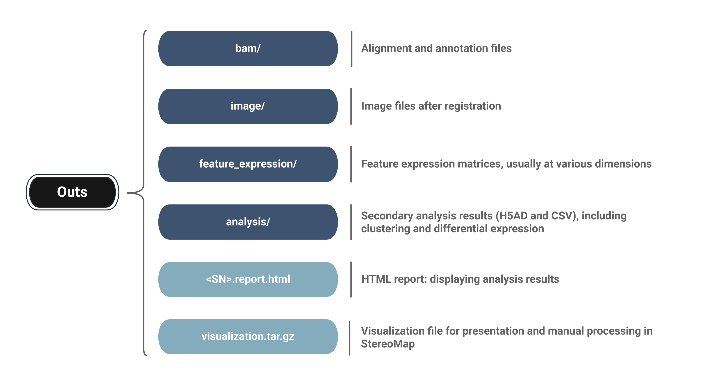

# Stereo-seq FF

This tutorial will teach you how to run `SAW count` pipeline on the Stereo-seq chip derived from a fresh frozen (FF) mouse kidney.

## Prerequisites

To run `SAW count` pipeline smoothly, you should:

* Be acquainted with the Linux system.
* Be familiar with running command line tools.
* Ensure access to a system that meets the [minimum system requirements](../download-center.md#system-requirements).


**Adequate storage** and **sufficient permissions** should be paid more attention to, before running pipelines.


## Overview of SAW count pipeline

Stereo-seq sequencing data from FF tissues is analyzed with `SAW count`.

The pipeline usually begins with:

* a chip mask file (recording CIDs of the Stereo-seq chip),
* FASTQ files (from Stereo-seq sequencing),
* a reference (chosen by the organism information),
* one or more microscope images (TIFF or image `.tar.gz` from **StereoMap**).


The compressed image `.tar.gz` file, from StereoMap, saves the original microscope images and the QC information.


<figure><figcaption></figcaption></figure>

Output results mainly include:

* BAMs of alignment and annotation,
* processed images,
* gene expression matrices at different dimensions,
* clustering and differential expression analysis,
* an integrated `visualization.tar.gz` for **StereoMap**.

## Demo data

Demo data of the mouse kidney from Stereo-seq Chip T is provided in this tutorial.

Key features of demo - C02533C1:

* Chip size: 1cm \* 1cm (S1)
* Bin1: 500 nm \* 500 nm
* Tissue section of 10μm thickness
* H&E-stained image acquired using Motic

[The dataset page](http://116.6.21.110:8090/share/21bb9df9-e6c5-47c5-9aa8-29f2d23a6df4) allows you to download the chip mask file, the raw sequencing files in FASTQ format, a TIFF image or an image `tar.gz`,  a reference. For better organization, creating new folders for corresponding data is a wise choice.

```sh
$ cd /saw

# Create sub-folders of different datasets
$ mkdir -p datasets/fastqs datasets/mask datasets/image datasets/reference
```

## Command lines

Set up `SAW count` analysis command in your working directory.

```sh
saw count \    
    --id=<task_id> \
    --sn=<SN> \
    --omics=transcriptomics \
    --kit-version="Stereo-seq T FF V1.2" \
    --sequencing-type="PE100_50+100" \
    --chip-mask=/path/to/chip/mask \
    --organism=<organism> \
    --tissue=<tissue> \
    --fastqs=/path/to/fastq/folders \
    --reference=/saw/datasets/reference \
    --image-tar=/path/to/image/tar

```

Brief descriptions of the mentioned parameters in command lines:

<table><thead><tr><th width="208">Parameter</th><th>Description</th></tr></thead><tbody><tr><td><code>--id</code></td><td>(Optional, default to None) A unique task id ([a-zA-Z0-9_-]+) which will be displayed as the output folder name and the title of HTML report. If the parameter is absent, <code>--sn</code> will play the same role.</td></tr><tr><td><code>--sn &#x3C;SN></code></td><td>(Required, default to None) SN (serial number) of the Stereo-seq chip.</td></tr><tr><td><code>--omics &#x3C;OMICS></code></td><td>(Required, default to "transcriptomics") Omics information.</td></tr><tr><td><code>--kit-version &#x3C;TEXT></code></td><td>(Required, default to None) The version of the product kit. More in <a href="../analysis/pipelines/count/">count pipeline introduction</a>.</td></tr><tr><td><code>--sequencing-type &#x3C;TEXT></code></td><td>(Required, default to None) Sequencing type of FASTQs which is recorded in the sequencing report.</td></tr><tr><td><code>--chip-mask &#x3C;MASK></code></td><td>(Required, default to None) Stereo-seq chip mask file.</td></tr><tr><td><code>--organism &#x3C;TEXT></code></td><td>(Optional, default to None) Organism type of sample, usually referring to species.</td></tr><tr><td><code>--tissue &#x3C;TEXT></code></td><td>(Optional, default to None) Physiological tissue of sample.</td></tr><tr><td><code>--reference &#x3C;PATH></code></td><td>(Optional, default to None) Path to the reference folder, containing SAW-compatible index files and GTF/GFF, built by <a href="preparation-of-reference.md#for-star"><code>SAW makeRef</code></a>.</td></tr><tr><td><code>--fastqs &#x3C;PATH></code></td><td>(Required, default to None) Path(s) to folder(s), containing all needed FASTQs. If FASTQs are stored in multiple directories, use it as: <code>--fastqs=/path/to/directory1,/path/to/directory2,...</code>.  Notice that all FASTQ files under these directories will be loaded for analysis. </td></tr><tr><td><code>--image &#x3C;TIFF></code></td><td>(Optional, default to None) TIFF image for QC (quality control), combined with expression matrix for analysis.<br><strong>Name rule for input TIFF :</strong><br>a. <code>&#x3C;SN>_&#x3C;stain_type>.tif</code><br>b. <code>&#x3C;SN>_&#x3C;stain_type>.tiff</code><br>c. <code>&#x3C;SN>_&#x3C;stain_type>.TIF</code><br>d. <code>&#x3C;SN>_&#x3C;stain_type>.TIFF</code><br><strong>&#x3C;stainType> includes:</strong><br>a. ssDNA<br>b. DAPI<br>c. HE (referring to H&#x26;E)<br>d. &#x3C;_IF_name1>_IF, &#x3C;IF_name2>_IF, ...</td></tr><tr><td><code>--image-tar &#x3C;TAR></code></td><td>(Optional, default to None) The compressed image <code>.tar.gz</code> file from StereoMap has been through prepositive QC (quality control).</td></tr></tbody></table>

## Run SAW count

Set up `SAW count` analysis command in your working directory.

```sh
cd /saw/runs

saw count \
    --id=Demo_Mouse_Kidney \
    --sn=C02533C1 \
    --omics=transcriptomics \
    --kit-version="Stereo-seq T FF V1.2" \
    --sequencing-type="PE100_50+100" \
    --chip-mask=/saw/datasets/mask/C02533C1.barcodeToPos.h5 \
    --organism=mouse \
    --tissue=kidney \
    --fastqs=/saw/datasets/fastqs \
    --reference=/saw/datasets/reference \
    --image-tar=/saw/datasets/image/C02533C1_SC_20240327_201353_4.0.0.tar.gz
    
```


If you input a or certain images in TIFF, the prefixes of the file names should be:

**\<SN>\_\<stain\_type>\_\*.tif**

When it comes to immunofluorescence staining (IF) image, that should be:

**\<SN>\_\<IF\_name>\_IF\_\*.tif**

e.g.:

* C04144D5\_ssDNA.tif
* SS200000135TL\_D1\_DAPI.tif
* C02533C1\_HE.tif (HE refers to H&E-stained)
* SS200000059\_NC\_DAPI.tif, SS200000059\_NC\_TESK2\_IF.tif, SS200000059\_NC\_APAK3\_IF.tif,...


## Explore the output structure

After pipeline analysis is completed, a new folder named `Demo_Mouse_Kidney` (which is provided by `--id`, or by `--sn` in the absence of `--id`) will appear in your working directory.

All the metadata and outputs generated from `SAW count` are listed below:

```
Demo_Mouse_Kidney
├── pipeline-logs
├── STEREO_ANALYSIS_WORKFLOW_PROCESSING
└── outs
    ├── analysis
    ├── bam
    ├── feature_expression
    ├── image
    ├── <SN>.report.tar.gz
    └── visualization.tar.gz
```

<figure><figcaption></figcaption></figure>

If you want to dig deeper into the results,

* Jump to the [`report.html`](../analysis/outputs/html-report.md) inside `<SN>.report.tar.gz`.
* Explore the [`visualization.tar.gz`](../analysis/outputs/count-outputs.md#visualization.tar.gz) in **StereoMap**.
* Learn more about the individual files on the [Outputs](../analysis/outputs/) page.
