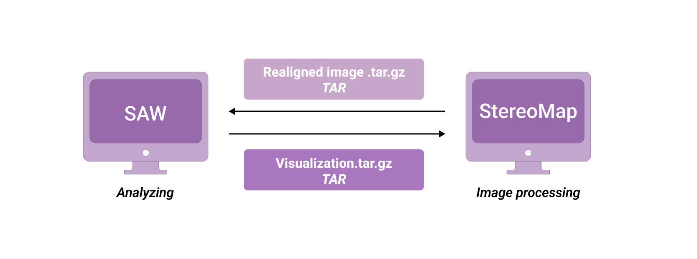
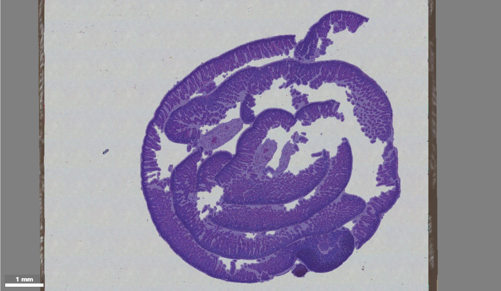

# With manually processed files

## Why manual processing?

* In certain scenarios, the outputs of `SAW count` are observed as not perfect enough. Therefore, researchers may want the images (with a matrix) manually adjusted or the segmentation results from third-party tools made accessible, to ensure satisfactory analysis.
* When the QC result of the image is unsuccessful, researchers have to manually fulfill the alignment between the microscope image and a spatial feature expression matrix.

In some instances, meticulous manual adjustments generate more accurate matrices for initiating downstream analysis.

## Overview of SAW realign

Manually processed datasets of FF and FFPE tissues can both be analyzed with `SAW realign`.

The pipeline usually begins with:

* the last related `SAW count` output folder,
* a realigned image `.tar.gz` from StereoMap (recording manual processing).


A realigned image `.tar.gz` file, from **StereoMap**, saves the original microscope images, QC information, and manual processing records.


<figure><figcaption><p>Interaction between SAW and StereoMap</p></figcaption></figure>

Output results mainly include:

* expression-related data from the last `SAW count`,
* processed images,
* feature expression matrices at different dimensions,
* clustering and differential expression analysis,
* an integrated `visualization.tar.gz` for **StereoMap**.

<table><thead><tr><th width="224">Parameter</th><th>Description</th></tr></thead><tbody><tr><td><code>-id &#x3C;ID></code></td><td>(Optional, default to None) A unique task id ([a-zA-Z0-9_-]+) which will be displayed as the output folder name and the title of HTML report. If the parameter is absent, <code>--sn</code> will play the same role.</td></tr><tr><td><code>--sn &#x3C;SN></code></td><td>(Required, default to None) SN (serial number) of the Stereo-seq chip.</td></tr><tr><td><code>--count-data &#x3C;PATH></code></td><td>(Required, default to None) Output folder of the corresponding <code>SAW count</code> result, which mainly contains the expression matrices and other related datasets.</td></tr><tr><td><code>--realigned-image-tar &#x3C;TAR></code></td><td>(Required, default to None) Compressed image file from StereoMap, which has been manually processed, including stitching, tissue segmentation, cell segmentation, calibration and registration.</td></tr><tr><td><code>--lasso-geojson &#x3C;GEOJSON></code></td><td>(Optional, default to None) Lasso GeoJSON from StereoMap is used for tissue segmentation when the analysis is without images. It is incompatible with <code>--realigned-image-tar</code>.</td></tr><tr><td><code>--adjusted-distance &#x3C;INT></code></td><td>(Optional, default to 10) Outspread distance based on the cellular contour of the cell segmentation image, in pixels. Default to 10. If <code>--adjusted-distance=0</code>, the pipeline will not expand the cell border.</td></tr></tbody></table>

When your analysis is without images, a lasso GeoJSON from **StereoMap** can be used as tissue re-segmentation, to extract a new `.tissue.gef` matrix.


`--lasso-geojson` is incompatible with `--realigned-image-tar`.


## The first run of SAW count

The inputs of `SAW count` runs are divided into three categories:

* **with a QC-passed image,**
* **with a QC-failed image,**
* **without an image.**

No matter what, the following common outputs will be generated in the output directory after running `SAW count`.&#x20;

```sh
Demo_Data
├── pipeline-logs
├── STEREO_ANALYSIS_WORKFLOW_PROCESSING
└── outs
    ├── analysis
    ├── bam
    ├── feature_expression
    ├── image
    ├── <SN>.report.tar.gz
    └── visualization.tar.gz
```


`visualization.tar.gz` is not only used for analysis presentations but also for manual adjustments in **StereoMap**. Modifications processed will be recorded in the image `.tar.gz` file.


When it comes to the analysis with a QC-failed image or without an image, tissue segmentation is performed based on the expression matrix. So the output results of these two have nothing to do with image algorithms during the automatic workflow.&#x20;

## Manual adjustments

Manual adjustments, including registration, tissue segmentation and cell segmentation, can be implemented in **StereoMap**. All of these require certain tools in **StereoMap**, to obtain the modified results that are visible in real time.

### Registration

The operation of registration always requires a matrix and a base image to be performed together. According to the tissue morphology, the analyst can align two layers with each other until there is a suitable overlap. **Image alignment is necessary for later steps.**

<figure><figcaption><p>A matrix heatmap and an H&#x26;E-stained image for registration</p></figcaption></figure>

### Tissue segmentation

Tissue segmentation refers to encircling the contour area by identifying the tissue morphology of the sample. A microscope image allows analysts to properly identify the relative position of tissue on the Stereo-seq chip.

<figure><figcaption><p>Tissue segmentation on an H&#x26;E-stained image</p></figcaption></figure>

### Cell segmentation

Cell segmentation refers to encircling the individual cellular areas by identifying the cell morphology. According to cellular contour, information at the cell dimension can be extracted from the whole sample.

<figure><figcaption></figcaption></figure>


Tissue and cell segmentations are key procedures in bioinformatics analysis, and appropriate segmentation results have an important impact on subsequent data analysis and interpretation.


## Back to SAW realign

### With a QC-passed image

[The third part](with-manually-processed-files.md#the-first-run-of-saw-count) of this tutorial is essential because the corresponding outputs of the last `SAW count` will help `SAW realign` to finish the remaining work, till generating the HTML report.

```sh
cd /saw/runs

saw realign \
    --id=Adjusted_Demo_Mouse_Brain \
    --sn=SS200000135TL_D1 \
    --count-data=/path/to/previous/SAW/count/task/folder \
    --realigned-image-tar=/path/to/realigned/image/tar
```

In `SAW realign`, as the same as `SAW count`, cell border expansion is performed automatically based on the cell segmentation mask image, which defaults to 10 pixels. You can set `--adjusted-distance` to adjust the expansion of cells according to various tissue samples and cell types.


[DNB](../getting-started/glossary.md#stomics-terminology) is the capture unit on the Stereo-seq chip.

DNBs correspond to the vertices of the square pixel block of the image after registration. If the expansion distance of the cell contour is X pixels, the physical distance would be estimated as X \* 500 nm.


If you are completely pleased with the cell segmentation (the manually processed one or the one from a third-party tool), set `--adjusted-distance=0` to close the expansion.

When it comes to the situation where you only need images or expression matrices from the realigned image `.tar.gz`, `--no-matrix` or `--no-report` parameters will meet your needs.

Run the pipeline just as:

```sh
cd /saw/runs

saw realign \
    --id=Demo_Mouse_Brain_Only_Images \
    --sn=SS200000135TL_D1 \
    --count-data=/path/to/previous/SAW/count/task/folder \
    --realigned-image-tar=/path/to/realigned/image/tar \
    --no-matrix
```

### With a QC-failed image

A basic manual registration for the QC-failed image has to be done before subsequent analysis.


SAW pipelines consider that QC-failed images which have been manually realigned by analysts, can be analyzed by applying automatic image algorithms in the following steps.


```sh
cd /saw/runs

saw realign \
    --id=Adjuated_Demo_Mouse_Brain \
    --sn=SS200000135TL_D1 \
    --count-data=/path/to/previous/SAW/count/task/folder \
    --realigned-image-tar=/path/to/realigned/image/tar
```

### Without an image

A lasso GeoJSON from **StereoMap** can be accepted by `SAW realign` for tissue re-segmentation.


Make sure there is **only** **one** label in your lasso GeoJSON, because a `SAW realign` run accepts a tissue re-segmentation outline once.

This works only in the scenario without image input. `--lasso-json` can not take effect with image-related parameters.


Run the pipeline just as:

```sh
cd /saw/runs

saw realign \
    --id=Lasso_Demo_Mouse_Brain \
    --sn=SS200000135TL_D1 \
    --count-data=/path/to/previous/SAW/count/task/folder \
    --lasso-geojson=/path/to/lasso/GeoJSON
```

## Output results of SAW realign

After pipeline analysis is completed, a new folder named `Adjusted_Demo_Mouse_Brain` (which is provided by `--id`, or by `--sn` in the absence of `--id`) will appear in your working directory.

All the metadata and outputs generated from `SAW realign` are listed below:

```
Adjusted_Demo_Mouse_Brain
├── pipeline-logs
├── STEREO_ANALYSIS_WORKFLOW_PROCESSING
└── outs
    ├── analysis
    ├── bam
    ├── feature_expression
    ├── image
    ├── <SN>.report.tar.gz
    └── visualization.tar.gz
```

<figure><figcaption></figcaption></figure>

If you want to dig deeper into the results,

* Jump to the [`report.html`](../analysis/outputs/html-report.md) inside `<SN>.report.tar.gz`.
* Explore the [`visualization.tar.gz`](../analysis/outputs/realign-outputs.md#visualization.tar.gz) in **StereoMap**.
* Learn more about the individual files on the [Outputs](../analysis/outputs/) page.
